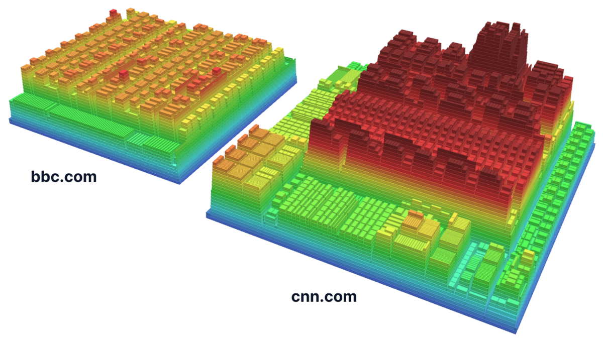

# DOM Relief

DOM structure visualiser based on general node feature footprints.

<a href="#example">
  
</a>
<br><br>

``` console
npm install webfuse-com/dom-relief
```

### Example

Draw and compare abstract 3D DOM-models. Works with both live and HTML-serialied DOM-instances.

```ts
import { DOMRelief } from "dom-relief";

const relief: DOMRelief = new DOMRelief({
  documents: [ pricingPageHTML, featuresPageHTML ]
});

relief.attach(document.querySelector("CANVAS"));

relief.update("orientation", "vertical");
relief.update({
  background: "#FFF",
  depthMax: 10,
  showGrid: false
});
```

> Open [example/example.html](./example/example.html) in a browser to use the interactive example application.

### API

#### `DOMRelief`

Create a DOM relief object with [configuration](#configuration) overrides.

``` ts
new DOMRelief(config?: Partial<DOMReliefConfig>)
```

``` ts
function createDOMRelief(config?: Partial<DOMReliefConfig>): DOMRelief
```

#### `attach()`, `detach()`

Attach a DOM relief object to a `CANVAS` element.

``` ts
DOMRelief.attach(target: HTMLCanvasElement): this
```

Detach a DOM relief object from a `CANVAS` element.

``` ts
DOMRelief.detach(): this
```

#### `update()`

Update a DOM relief object's [configuration](#configuration).

``` ts
DOMRelief.update(key: string, value: unknown): this
DOMRelief.update({ [ key: string ]: unknown; }): this
```

#### `dispose()`

Dispose of a DOM relief object, which means allocated resources are released.

``` ts
DOMRelief.dispose(): void
```

### Configuration

| Option | Description | Type | Default |
| :- | :- | :- | :- |
| `attributeWeight` | Scale how much total attribute length adds to an element's footprint. | `number` | `1` |
| `autoFit` | Reframe the view when documents, orientation or scaling change. | `boolean` | `true` |
| `autoRotate` | Rotate the view slowly around the models. | `boolean` | `false` |
| `background` | Set the stage background to any CSS color. | `string` | `"#F8FAFC"` |
| `depthMax` | Show this depth and deeper as full red when coloring by depth. | `number` | `15` |
| `documents` | Show these HTML strings, Documents or Elements side by side. | `DocumentSource[]` | `[]` |
| `gap` | Set the padding between a parent's edge and its children. | `number` | `0.25` |
| `gridColor` | Set the grid lines to any CSS color. | `string` | `"#DADDE0"` |
| `interactive` | Let the pointer rotate, pan and zoom the view, and double-click refit it. | `boolean` | `true` |
| `layerThickness` | Set the thickness of every layer, so elevation equals depth times thickness. | `number` | `2.0` |
| `layout` | Arrange children in document order (`"ordered"`) or as size-sorted tiles (`"squarified"`). | `LayoutMode` | `"ordered"` |
| `maxDepth` | Stop descending below this depth. | `number` | `300` |
| `maxNodes` | Stop parsing a document after this many nodes. | `number` | `40000` |
| `orientation` | Lay the models flat (`"horizontal"`) or stand them up like a screen (`"vertical"`). | `Orientation` | `"horizontal"` |
| `sameScale` | Draw all documents in the same units, or give each the same footprint when off. | `boolean` | `true` |
| `showGrid` | Show the grid as a floor or back wall. | `boolean` | `true` |
| `skipHead` | Start at `<body>` instead of `<html>`. | `boolean` | `true` |
| `skipScripts` | Ignore `script`, `style`, `template` and `noscript` elements. | `boolean` | `true` |
| `textNodes` | Turn each text run into its own leaf block. | `boolean` | `false` |
| `textWeight` | Scale how much direct text length adds to an element's footprint. | `number` | `1` |

``` ts
interface DOMReliefConfig {
  attributeWeight: number;
  autoFit: boolean;
  autoRotate: boolean;
  background: string;
  depthMax: number;
  documents: DocumentSource[];
  gap: number;
  gridColor: string;
  interactive: boolean;
  layerThickness: number;
  layout: LayoutMode;
  maxDepth: number;
  maxNodes: number;
  orientation: Orientation;
  sameScale: boolean;
  showGrid: boolean;
  skipHead: boolean;
  skipScripts: boolean;
  textNodes: boolean;
  textWeight: number;
}
```

### Definition of _Footprint_

The **footprint** `A` of an element *e* is the base area (horizontal orientation) of its block in the layout plane:

```
A(e) = width × length
```

The root block is a square of side `√W(root)`:

```
A(root) = W(root)
```

Children share their parent *p*'s inner area, which is `A(p)` minus the `gap` padding, in proportion to their weights:

```
A(c) = A_inner(p) · W(c) / Σ W(siblings)
```

`W` is the **subtree weight** of *e*, summed over all its children *c*:

```
W(e) = W_own(e) + Σ W(c)
```

`W_own` is the **own weight** of the outer element itself:

```
W_own(e) = 1 + 0.45 · attributeWeight · ln(1 + n_attr(e)) + 0.45 · textWeight · ln(1 + n_text(e))
```

`n_attr` is the combined length of all attribute names and values of *e*, and `n_text` is the length of the trimmed text directly inside *e*.

A footprint is exactly proportional to weight among siblings, whilst `A / W` falls slightly below 1 with each nesting level.

> Unless `sameScale` is used with the API, each root is scaled to side 24, i.e. `A(root) = 576`.